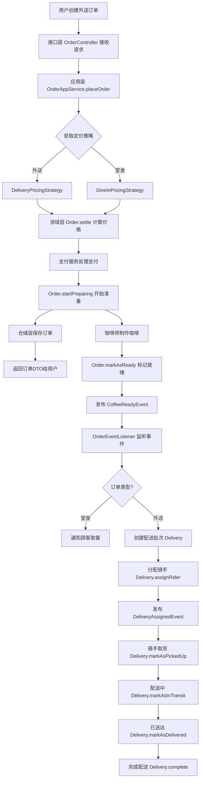
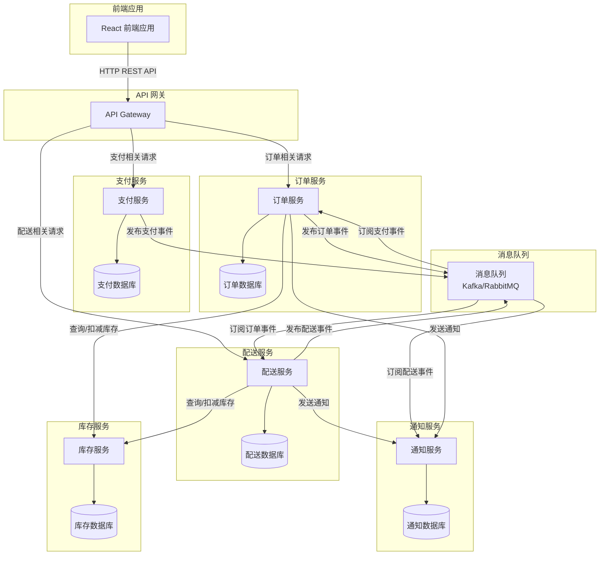

非常好！现在我已经充分了解了这个咖啡店项目的代码结构。让我用最简单易懂的方式为你解释 **DDD（领域驱动设计）** 和 **微服务**，并结合这个咖啡店项目来具体说明。

---

## 📚 总体概述

这个咖啡店项目是一个非常好的教学案例，它展示了如何使用 **DDD（领域驱动设计）** 来构建一个清晰的业务系统，同时也展示了如何将这样的系统拆分为 **微服务**。

---

## 🏗️ 第一部分：什么是 DDD（领域驱动设计）？

### 简单来说

DDD 是一种软件开发方法，它的核心思想是：**让代码和业务语言保持一致**。

想象一下，你在和咖啡店老板聊天：
- 老板说："我们有一个订单，订单里有咖啡，咖啡有价格，订单可以堂食或外卖"
- 在代码中，我们也应该有：`Order`（订单）、`OrderItem`（订单项）、`Money`（金额）、`DINE_IN`/`DELIVERY`（堂食/外卖）

这就是 DDD 的核心：**代码中的术语应该和业务术语完全一致**。

---

### 代码结构分析

在这个咖啡店项目中，DDD 体现在以下几个关键部分：

#### 1. **分层架构** - 代码是如何组织的

这个项目采用了经典的 DDD 四层架构：

```
┌─────────────────────────────────────────┐
│  接口层              │
│  负责接收用户请求，返回响应               │
│  例如：OrderController, DeliveryController│
└─────────────────────────────────────────┘
              ↓
┌─────────────────────────────────────────┐
│  应用层            │
│  负责协调各个领域对象完成业务流程         │
│  例如：OrderAppService, DeliveryAppService│
└─────────────────────────────────────────┘
              ↓
┌─────────────────────────────────────────┐
│  领域层                │
│  核心业务逻辑，最重要的部分               │
│  例如：Order, Delivery, PricingStrategy │
└─────────────────────────────────────────┘
              ↓
┌─────────────────────────────────────────┐
│  基础设施层        │
│  负责数据存储、外部服务调用               │
│  例如：OrderRepository, PaymentService   │
└─────────────────────────────────────────┘
```

**为什么要这样分层？**
- **接口层**：只管接收请求和返回结果，不包含业务逻辑
- **应用层**：只负责"指挥"，告诉各个领域对象该做什么
- **领域层**：包含所有核心业务规则，这是最宝贵的地方
- **基础设施层**：处理技术细节，比如数据库、支付接口等

#### 2. **聚合** - 相关对象的集合

在 DDD 中，聚合是一组相关的对象，它们作为一个整体被对待。

**在这个项目中：**

- **订单聚合**：
  - **聚合根**：[`Order`](src/main/java/com/bluemountain/coffee/domain/model/aggregate/Order.java:43) - 订单本身
  - **实体**：[`OrderItem`](src/main/java/com/bluemountain/coffee/domain/model/aggregate/OrderItem.java) - 订单中的咖啡项
  - **值对象**：[`Money`](src/main/java/com/bluemountain/coffee/domain/model/valobj/Money.java)（金额）、[`Address`](src/main/java/com/bluemountain/coffee/domain/model/valobj/Address.java)（地址）、[`OrderId`](src/main/java/com/bluemountain/coffee/domain/model/valobj/OrderId.java)（订单ID）

- **配送聚合**：
  - **聚合根**：[`Delivery`](src/main/java/com/bluemountain/coffee/domain/model/aggregate/Delivery.java:38) - 配送批次
  - **实体**：[`DeliveryItem`](src/main/java/com/bluemountain/coffee/domain/model/aggregate/DeliveryItem.java) - 配送中的订单
  - **值对象**：[`RiderInfo`](src/main/java/com/bluemountain/coffee/domain/model/valobj/RiderInfo.java)（骑手信息）、[`DeliveryId`](src/main/java/com/bluemountain/coffee/domain/model/valobj/DeliveryId.java)（配送ID）

**什么是聚合根？**
聚合根是聚合的入口点。外部代码只能通过聚合根来访问聚合内部的对象。

**举个例子：**
```java
// 正确：通过聚合根访问
Order order = orderRepository.findById(orderId);
List<OrderItem> items = order.getItems(); // 通过 Order 访问 OrderItem

// 错误：直接访问 OrderItem（不允许）
OrderItem item = orderItemRepository.findById(itemId); // ❌ 不应该这样做
```

#### 3. **值对象** - 不可变的描述性对象

值对象是通过其属性值来标识的对象，而不是通过唯一标识符。值对象是不可变的，一旦创建就不能修改。

**在这个项目中的值对象：**

- [`Money`](src/main/java/com/bluemountain/coffee/domain/model/valobj/Money.java) - 金额，包含数值和货币单位
- [`Address`](src/main/java/com/bluemountain/coffee/domain/model/valobj/Address.java) - 地址，包含街道、城市、邮编等
- [`RiderInfo`](src/main/java/com/bluemountain/coffee/domain/model/valobj/RiderInfo.java) - 骑手信息
- [`OrderId`](src/main/java/com/bluemountain/coffee/domain/model/valobj/OrderId.java)、[`DeliveryId`](src/main/java/com/bluemountain/coffee/domain/model/valobj/DeliveryId.java) - 各种 ID

**为什么使用值对象？**
- **不可变性**：一旦创建就不能修改，避免数据不一致
- **可读性**：代码更清晰，`Money` 比 `double` 更能表达意图
- **复用性**：可以在多个地方使用相同的值对象

#### 4. **领域服务** - 不属于任何特定对象的业务逻辑

当某些业务逻辑不适合放在实体或值对象中时，就使用领域服务。

**在这个项目中：**

- [`PricingStrategy`](src/main/java/com/bluemountain/coffee/domain/service/PricingStrategy.java) - 定价策略接口
  - [`DineInPricingStrategy`](src/main/java/com/bluemountain/coffee/domain/strategy/DineInPricingStrategy.java) - 堂食定价（无额外费用）
  - [`DeliveryPricingStrategy`](src/main/java/com/bluemountain/coffee/domain/strategy/DeliveryPricingStrategy.java) - 外送定价（包装费 + 配送费）

- [`DeliveryBatchService`](src/main/java/com/bluemountain/coffee/domain/service/DeliveryBatchService.java) - 配送批处理服务接口
  - [`DeliveryBatchServiceImpl`](src/main/java/com/bluemountain/coffee/infrastructure/service/DeliveryBatchServiceImpl.java) - 配送批处理服务实现

#### 5. **领域事件** - 重要的业务事件

领域事件是在领域内发生的、对业务有意义的事情。

**在这个项目中：**

- **订单相关事件**：
  - [`OrderCreatedEvent`](src/main/java/com/bluemountain/coffee/domain/event/OrderCreatedEvent.java) - 订单创建
  - [`CoffeeReadyEvent`](src/main/java/com/bluemountain/coffee/domain/event/CoffeeReadyEvent.java) - 咖啡准备就绪

- **配送相关事件**：
  - [`DeliveryCreatedEvent`](src/main/java/com/bluemountain/coffee/domain/event/DeliveryCreatedEvent.java) - 配送创建
  - [`DeliveryAssignedEvent`](src/main/java/com/bluemountain/coffee/domain/event/DeliveryAssignedEvent.java) - 骑手分配
  - [`DeliveryPickedUpEvent`](src/main/java/com/bluemountain/coffee/domain/event/DeliveryPickedUpEvent.java) - 取货
  - [`DeliveryDeliveredEvent`](src/main/java/com/bluemountain/coffee/domain/event/DeliveryDeliveredEvent.java) - 送达
  - [`DeliveryCompletedEvent`](src/main/java/com/bluemountain/coffee/domain/event/DeliveryCompletedEvent.java) - 完成

**为什么使用领域事件？**
- **解耦**：当事件发生时，其他部分可以订阅并处理，而不需要直接调用
- **可追溯**：可以记录所有重要的业务事件
- **扩展性**：可以轻松添加新的事件处理器

---

### 分步逻辑详解

让我用一个具体的例子来说明 DDD 是如何工作的：**创建一个外送订单**

#### 步骤 1：用户发起请求

用户通过前端界面创建一个外送订单，请求发送到接口层。

#### 步骤 2：接口层接收请求

[`OrderController`](src/main/java/com/bluemountain/coffee/interfaces/web/OrderController.java) 接收到 HTTP 请求，将请求转换为 `CreateOrderCommand` 对象。

#### 步骤 3：应用层协调流程

[`OrderAppService.placeOrder()`](src/main/java/com/bluemountain/coffee/application/OrderAppService.java:81) 方法被调用：

```java
public OrderDTO placeOrder(CreateOrderCommand command) {
    // 1. 转换命令到领域对象
    Order order = orderAssembler.toDomain(command);
    
    // 2. 获取对应的定价策略
    PricingStrategy pricingStrategy = pricingStrategyFactory.getStrategy(order.getType());
    
    // 3. 结算订单（计算价格）
    order.settle(pricingStrategy);
    
    // 4. 处理支付
    paymentService.processPayment(order.getId(), order.getTotalPrice());
    
    // 5. 开始准备
    order.startPreparing();
    
    // 6. 保存订单
    order = orderRepository.save(order);
    
    return orderAssembler.toDTO(order);
}
```

#### 步骤 4：领域层执行业务逻辑

在 [`Order.settle()`](src/main/java/com/bluemountain/coffee/domain/model/aggregate/Order.java:170) 方法中：

```java
public void settle(PricingStrategy pricingStrategy) {
    // 验证状态转换
    if (status != OrderStatus.CREATED) {
        throw new InvalidOrderStateException(status.name(), OrderStatus.SETTLED.name());
    }
    
    // 使用策略模式计算总价
    this.totalPrice = pricingStrategy.calculate(this);
    this.status = OrderStatus.SETTLED;
    this.updatedAt = LocalDateTime.now();
}
```

这里使用了 **策略模式**，根据订单类型选择不同的定价策略：
- 堂食：只计算咖啡价格
- 外送：咖啡价格 + 包装费 + 配送费

#### 步骤 5：发布领域事件

当订单状态变化时，会发布领域事件。例如，当咖啡准备就绪时：

```java
public void markAsReady() {
    if (status != OrderStatus.PREPARING) {
        throw new InvalidOrderStateException(status.name(), OrderStatus.READY.name());
    }
    
    this.status = OrderStatus.READY;
    this.updatedAt = LocalDateTime.now();
    
    // 发布领域事件
    if (eventPublisher != null) {
        eventPublisher.publishEvent(new CoffeeReadyEvent(
            this,
            this.id,
            this.type.name(),
            this.customerName
        ));
    }
}
```

#### 步骤 6：事件监听器处理事件

[`OrderEventListener`](src/main/java/com/bluemountain/coffee/application/OrderEventListener.java) 监听到 `CoffeeReadyEvent` 后：

- 如果是堂食订单：通知顾客取餐
- 如果是外送订单：创建配送批次，分配骑手

---

### Mermaid 流程图

下面是一个创建外送订单的完整流程图：



---

### 流程图解读

这个流程图展示了从创建订单到完成配送的完整过程：

1. **订单创建阶段**（A-K）：
   - 用户通过前端界面创建订单
   - 接口层接收请求并传递给应用层
   - 应用层根据订单类型选择定价策略
   - 领域层计算价格并更新订单状态
   - 支付服务处理支付
   - 订单被保存到仓储中

2. **咖啡制作阶段**（L-N）：
   - 咖啡师开始制作咖啡
   - 制作完成后标记订单为"已就绪"
   - 发布 `CoffeeReadyEvent` 领域事件

3. **配送阶段**（O-X，仅外送订单）：
   - 事件监听器监听到咖啡就绪事件
   - 如果是外送订单，创建配送批次
   - 分配骑手并发布 `DeliveryAssignedEvent`
   - 骑手取货、配送中、送达、完成

**关键点：**
- 每个阶段都有明确的职责
- 通过领域事件实现解耦
- 状态转换有严格的验证
- 使用策略模式处理不同的业务场景

---

## 🌐 第二部分：什么是微服务？

### 简单来说

微服务是一种架构风格，它将一个大型应用程序拆分成多个小的、独立的服务，每个服务负责一个特定的业务功能。

**打个比方：**
- **单体应用**：像一个超级大厨房，所有厨师在一个大厨房里做饭，互相影响
- **微服务**：像多个小餐厅，每个餐厅专门做一种菜，互不干扰

---

### 微服务的特点

1. **独立性**：每个微服务可以独立开发、部署、扩展
2. **单一职责**：每个微服务只负责一个业务功能
3. **通信**：微服务之间通过 API（通常是 REST API 或消息队列）进行通信
4. **技术自由**：不同的微服务可以使用不同的技术栈
5. **数据隔离**：每个微服务有自己的数据库

---

### 这个咖啡店项目如何拆分为微服务？

基于 DDD 的限界上下文概念，这个咖啡店项目可以拆分为以下微服务：

#### 1. **订单服务**
- **职责**：管理订单的整个生命周期
- **核心功能**：
  - 创建订单（堂食/外送）
  - 订单状态管理（已创建 → 已支付 → 准备中 → 已完成）
  - 订单查询
- **API 端点**：
  - `POST /api/orders` - 创建订单
  - `GET /api/orders/{id}` - 获取订单
  - `PUT /api/orders/{id}/status` - 更新订单状态
- **数据库**：订单数据库（存储订单、订单项等）

#### 2. **配送服务**
- **职责**：管理配送批处理和骑手
- **核心功能**：
  - 创建配送批次
  - 分配骑手
  - 配送状态管理（已创建 → 已分配 → 已取货 → 配送中 → 已送达 → 已完成）
  - 配送查询
- **API 端点**：
  - `POST /api/deliveries/batch` - 创建配送批次
  - `POST /api/deliveries/{id}/assign-rider` - 分配骑手
  - `GET /api/deliveries/active` - 获取活跃配送
- **数据库**：配送数据库（存储配送、配送项、骑手信息等）

#### 3. **支付服务**
- **职责**：处理支付和退款
- **核心功能**：
  - 处理支付
  - 处理退款
  - 支付状态查询
- **API 端点**：
  - `POST /api/payments` - 处理支付
  - `POST /api/payments/refund` - 处理退款
- **数据库**：支付数据库（存储支付记录、退款记录等）

#### 4. **通知服务**
- **职责**：发送通知（短信、邮件、推送）
- **核心功能**：
  - 发送订单状态通知
  - 发送配送状态通知
- **API 端点**：
  - `POST /api/notifications` - 发送通知
- **数据库**：通知数据库（存储通知记录等）

#### 5. **库存服务**
- **职责**：管理咖啡和原料库存
- **核心功能**：
  - 查询库存
  - 扣减库存
  - 补充库存
- **API 端点**：
  - `GET /api/inventory` - 查询库存
  - `PUT /api/inventory` - 更新库存
- **数据库**：库存数据库（存储咖啡、原料等）

---

### 微服务架构图



---

### 流程图解读

这个微服务架构图展示了各个服务之间的关系：

1. **前端应用**：
   - React 前端应用通过 HTTP REST API 与后端通信
   - 所有请求都通过 API 网关进行路由

2. **API 网关**：
   - 统一的入口点
   - 根据请求类型路由到不同的微服务
   - 提供认证、限流、日志等横切关注点

3. **订单服务**：
   - 管理订单的整个生命周期
   - 拥有自己的数据库
   - 发布订单相关的领域事件到消息队列

4. **配送服务**：
   - 管理配送批处理和骑手
   - 拥有自己的数据库
   - 订阅订单事件，当订单就绪时创建配送
   - 发布配送相关的领域事件

5. **支付服务**：
   - 处理支付和退款
   - 拥有自己的数据库
   - 发布支付相关的领域事件

6. **通知服务**：
   - 发送各种通知
   - 订阅订单和配送事件，发送状态通知

7. **库存服务**：
   - 管理咖啡和原料库存
   - 订单服务和配送服务可以查询和扣减库存

8. **消息队列**：
   - 实现服务之间的异步通信
   - 解耦服务，提高系统的弹性和可扩展性

---

## 🔗 第三部分：DDD 与微服务的关系

### DDD 如何指导微服务的拆分？

DDD 的 **限界上下文** 概念是微服务拆分的重要指导原则。

**限界上下文**：定义了特定领域模型的边界。在限界上下文内部，所有的术语和概念都有明确的含义，不会产生歧义。

**在这个咖啡店项目中：**

- **订单上下文**：管理订单的生命周期
  - 核心概念：订单、订单项、订单状态
  - 聚合根：Order
  - 可以拆分为：订单服务

- **配送上下文**：管理配送批处理和骑手
  - 核心概念：配送、配送项、骑手、配送状态
  - 聚合根：Delivery
  - 可以拆分为：配送服务

- **支付上下文**：管理支付和退款
  - 核心概念：支付、退款、支付状态
  - 可以拆分为：支付服务

### DDD 在微服务中的体现

#### 1. **每个微服务都是一个限界上下文**

每个微服务都有自己的领域模型，有自己的业务规则，有自己的数据库。

#### 2. **聚合根作为微服务的边界**

每个微服务通常围绕一个或多个聚合根来构建。外部服务只能通过聚合根来访问聚合内部的对象。

#### 3. **领域事件实现服务间通信**

微服务之间通过领域事件进行异步通信，实现解耦。

**在这个项目中：**
- 订单服务发布 `CoffeeReadyEvent`
- 配送服务订阅 `CoffeeReadyEvent`，创建配送批次
- 通知服务订阅 `DeliveryAssignedEvent`，发送通知

---

## 📊 DDD 与微服务的对比

| 方面 | DDD | 微服务 |
|------|-----|--------|
| **核心思想** | 让代码和业务语言保持一致 | 将大型应用拆分为小的独立服务 |
| **关注点** | 领域建模、业务逻辑 | 服务拆分、部署、通信 |
| **指导原则** | 限界上下文、聚合、领域事件 | 单一职责、独立性、通信 |
| **实现方式** | 分层架构、领域模型 | REST API、消息队列 |
| **关系** | DDD 指导微服务的拆分 | 微服务是 DDD 的实现方式之一 |

---

## 🎯 总结

### DDD 的核心要点

1. **统一语言**：代码中的术语和业务术语保持一致
2. **分层架构**：接口层、应用层、领域层、基础设施层
3. **聚合**：相关对象的集合，通过聚合根访问
4. **值对象**：不可变的描述性对象
5. **领域服务**：不属于任何特定对象的业务逻辑
6. **领域事件**：重要的业务事件，实现解耦

### 微服务的核心要点

1. **独立性**：每个服务可以独立开发、部署、扩展
2. **单一职责**：每个服务只负责一个业务功能
3. **通信**：通过 API 或消息队列进行通信
4. **技术自由**：可以使用不同的技术栈
5. **数据隔离**：每个服务有自己的数据库

### DDD 与微服务的关系

- **DDD 指导微服务的拆分**：通过限界上下文、聚合等概念来划分服务边界
- **微服务是 DDD 的实现方式之一**：每个微服务都是一个限界上下文
- **领域事件实现服务间通信**：通过发布-订阅模式实现解耦

---

希望这个解释能帮助你理解 DDD 和微服务的概念，以及它们在这个咖啡店项目中的具体应用！如果你有任何问题，随时可以问我。☕