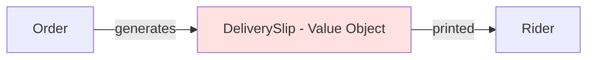
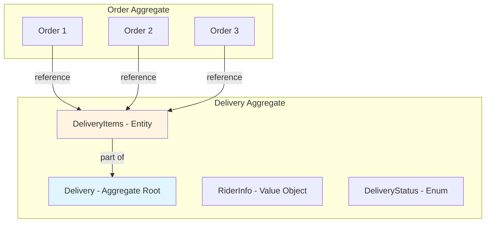
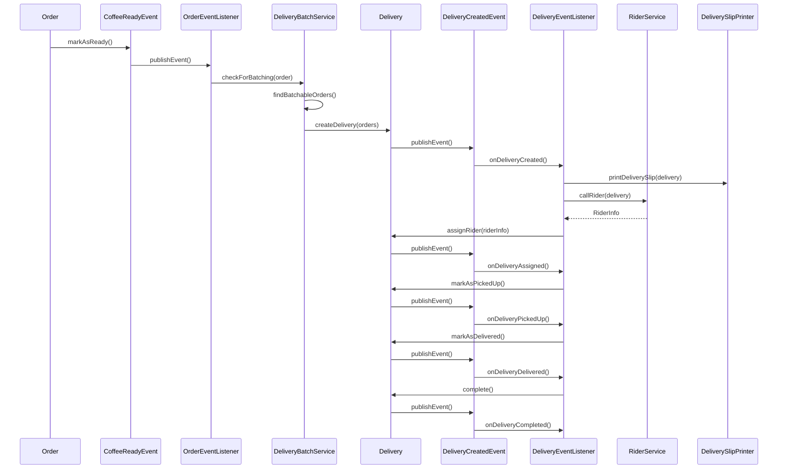

# Delivery Batch Architecture: Multi-Order Delivery Design

## Problem Statement

The original design assumed a 1:1 relationship between Order and DeliverySlip. However, in real-world scenarios, a single rider may deliver multiple orders together (batch delivery), and we need to track the complete lifecycle from creation to delivery completion.

## DDD Design Decision: Delivery as Aggregate Root

**Question:** Should Delivery be an Aggregate Root?

**Answer:** **YES**, `Delivery` should be an **Aggregate Root** when supporting multi-order batch deliveries.

### Rationale

1. **Independent Lifecycle**: A Delivery has its own lifecycle independent of individual Orders
   - Created when orders are ready for batching
   - Assigned to a rider
   - Picked up by rider
   - Delivered to customer(s)
   - Completed

2. **Unique Identity**: Each Delivery has a unique identifier (DeliveryId) separate from OrderIds

3. **State Management**: Delivery has its own state transitions:
   - CREATED → ASSIGNED → PICKED_UP → IN_TRANSIT → DELIVERED → COMPLETED

4. **Multiple Orders**: A Delivery can contain multiple Orders (batch delivery)
   - One-to-many relationship: Delivery → Orders
   - Orders can be grouped by geographic proximity or time window

5. **Business Rules**: Delivery has its own invariants:
   - All orders in a delivery must have the same delivery address (or nearby addresses)
   - All orders must be in READY state before delivery creation
   - Delivery cannot be modified after being assigned to a rider

## Architecture Comparison

### Original Design (1:1 Order → DeliverySlip)



**Problems with this design for multi-order delivery:**
- No way to track which orders are delivered together
- No delivery lifecycle management
- Cannot query deliveries by rider, status, or time range
- No delivery history or audit trail

### New Design (1:N Orders → Delivery Aggregate)



**Benefits of this design:**
- Complete delivery lifecycle tracking
- Batch delivery support
- Queryable delivery history
- Proper DDD aggregate boundaries

## Domain Model Design

### Delivery Aggregate Root

**File:** `src/main/java/com/bluemountain/coffee/domain/model/aggregate/Delivery.java`

**Purpose:** Aggregate root representing a delivery batch containing one or more orders.

**Attributes:**
- `deliveryId` (DeliveryId) - Unique delivery identifier
- `orders` (List<Order>) - Orders in this delivery (references, not owned)
- `riderInfo` (RiderInfo) - Assigned rider information
- `status` (DeliveryStatus) - Current delivery status
- `pickupTime` (LocalDateTime) - When rider picked up orders
- `deliveryTime` (LocalDateTime) - When delivery was completed
- `createdAt` (LocalDateTime) - When delivery was created
- `updatedAt` (LocalDateTime) - Last update timestamp

**Key Behaviors:**
- `assignRider(RiderInfo rider)` - Assign a rider to this delivery
- `markAsPickedUp()` - Mark as picked up by rider
- `markAsInTransit()` - Mark as in transit
- `markAsDelivered()` - Mark as delivered to customer
- `complete()` - Complete the delivery
- `cancel()` - Cancel the delivery (before pickup)

**Invariants:**
- Cannot assign rider if status is not CREATED
- Cannot mark as picked up if no rider assigned
- Cannot mark as delivered if not in transit
- Cannot cancel after pickup

### DeliveryStatus Enum

**File:** `src/main/java/com/bluemountain/coffee/domain/model/enums/DeliveryStatus.java`

**Values:**
- `CREATED` - Delivery created, waiting for rider assignment
- `ASSIGNED` - Rider assigned, waiting for pickup
- `PICKED_UP` - Rider picked up orders
- `IN_TRANSIT` - Rider is on the way to delivery location
- `DELIVERED` - Orders delivered to customer
- `COMPLETED` - Delivery completed
- `CANCELLED` - Delivery cancelled

**State Transitions:**
```
CREATED → ASSIGNED → PICKED_UP → IN_TRANSIT → DELIVERED → COMPLETED
    ↓
CANCELLED (only from CREATED or ASSIGNED)
```

### DeliveryId Value Object

**File:** `src/main/java/com/bluemountain/coffee/domain/model/valobj/DeliveryId.java`

**Purpose:** Unique identifier for a delivery.

**Pattern:** Value Object (similar to OrderId)

### DeliveryItem Entity

**File:** `src/main/java/com/bluemountain/coffee/domain/model/aggregate/DeliveryItem.java`

**Purpose:** Represents an order within a delivery.

**Attributes:**
- `orderId` (OrderId) - Reference to the order
- `order` (Order) - The order entity (for access)
- `itemStatus` (DeliveryItemStatus) - Status of this specific item

**DeliveryItemStatus:**
- `READY` - Order ready for delivery
- `PICKED_UP` - Item picked up by rider
- `DELIVERED` - Item delivered to customer

### DeliveryRepository Interface

**File:** `src/main/java/com/bluemountain/coffee/domain/repository/DeliveryRepository.java`

**Purpose:** Repository for Delivery aggregates.

**Methods:**
- `save(Delivery delivery)` - Save or update delivery
- `findById(DeliveryId deliveryId)` - Find delivery by ID
- `findByStatus(DeliveryStatus status)` - Find deliveries by status
- `findByRiderId(String riderId)` - Find deliveries by rider
- `findByOrderId(OrderId orderId)` - Find delivery containing a specific order
- `findActiveDeliveries()` - Find all active (not completed) deliveries
- `findDeliveriesBetween(LocalDateTime start, LocalDateTime end)` - Find deliveries in date range

## Directory Structure

```text
src/main/java/com/bluemountain/coffee/
├── domain/
│   ├── model/
│   │   ├── aggregate/
│   │   │   ├── Order.java              (Aggregate Root - EXISTS)
│   │   │   ├── OrderItem.java          (Entity - EXISTS)
│   │   │   ├── Delivery.java          (Aggregate Root - NEW)
│   │   │   └── DeliveryItem.java      (Entity - NEW)
│   │   ├── valobj/
│   │   │   ├── OrderId.java            (Value Object - EXISTS)
│   │   │   ├── Money.java               (Value Object - EXISTS)
│   │   │   ├── Address.java            (Value Object - EXISTS)
│   │   │   ├── DeliveryId.java         (Value Object - NEW)
│   │   │   ├── RiderInfo.java          (Value Object - NEW)
│   │   │   ├── DeliverySlip.java       (Value Object - NEW)
│   │   │   └── DeliverySlipItem.java   (Value Object - NEW)
│   │   └── enums/
│   │       ├── OrderType.java          (Enum - EXISTS)
│   │       ├── OrderStatus.java        (Enum - EXISTS)
│   │       ├── DeliveryStatus.java     (Enum - NEW)
│   │       └── DeliveryItemStatus.java (Enum - NEW)
│   ├── service/
│   │   ├── PricingStrategy.java        (Domain Service Interface - EXISTS)
│   │   ├── DeliverySlipPrinter.java    (Domain Service Interface - NEW)
│   │   ├── RiderService.java          (Domain Service Interface - NEW)
│   │   └── DeliveryBatchService.java   (Domain Service Interface - NEW)
│   ├── repository/
│   │   ├── OrderRepository.java        (Repository Interface - EXISTS)
│   │   └── DeliveryRepository.java     (Repository Interface - NEW)
│   └── event/
│       ├── OrderCreatedEvent.java      (Domain Event - EXISTS)
│       ├── CoffeeReadyEvent.java      (Domain Event - EXISTS)
│       ├── DeliveryCreatedEvent.java  (Domain Event - NEW)
│       ├── DeliveryAssignedEvent.java  (Domain Event - NEW)
│       ├── DeliveryPickedUpEvent.java (Domain Event - NEW)
│       ├── DeliveryDeliveredEvent.java (Domain Event - NEW)
│       └── DeliveryCompletedEvent.java (Domain Event - NEW)
├── infrastructure/
│   ├── persistence/
│   │   ├── InMemoryOrderRepository.java (Repository Implementation - EXISTS)
│   │   └── InMemoryDeliveryRepository.java (Repository Implementation - NEW)
│   └── service/
│       ├── NotificationService.java    (Infrastructure Service - EXISTS)
│       ├── PaymentService.java         (Infrastructure Service - EXISTS)
│       ├── DeliverySlipPrinterImpl.java (Service Implementation - NEW)
│       ├── RiderServiceImpl.java       (Service Implementation - NEW)
│       └── DeliveryBatchServiceImpl.java (Service Implementation - NEW)
├── application/
│   ├── OrderAppService.java           (Application Service - EXISTS)
│   ├── OrderAssembler.java            (Assembler - EXISTS)
│   ├── OrderEventListener.java        (Event Listener - MODIFY)
│   ├── DeliveryAppService.java        (Application Service - NEW)
│   ├── DeliveryEventListener.java     (Event Listener - NEW)
│   └── PricingStrategyFactory.java    (Factory - EXISTS)
└── interfaces/
    ├── dto/
    │   ├── OrderDTO.java              (DTO - EXISTS)
    │   ├── OrderItemDTO.java          (DTO - EXISTS)
    │   ├── CreateOrderCommand.java   (Command - EXISTS)
    │   ├── DeliveryDTO.java           (DTO - NEW)
    │   └── DeliveryItemDTO.java       (DTO - NEW)
    └── web/
        ├── OrderController.java       (Controller - EXISTS)
        └── DeliveryController.java    (Controller - NEW)
```

## Delivery Batching Strategy

### DeliveryBatchService Domain Service

**Purpose:** Groups orders into delivery batches based on business rules.

**Batching Rules:**
1. **Geographic Proximity**: Group orders with nearby addresses
2. **Time Window**: Group orders within a specific time window (e.g., 15 minutes)
3. **Capacity Limit**: Maximum orders per delivery (e.g., 5 orders)
4. **Same Address Priority**: Orders to same address should be in same delivery

**Methods:**
- `createDeliveryBatch(List<Order> orders)` - Create a delivery from multiple orders
- `findBatchableOrders()` - Find orders ready for batching
- `autoBatchOrders()` - Automatically batch orders based on rules

## Event Flow

### Complete Delivery Lifecycle



## Implementation Steps

### Step 1: Create DeliveryId Value Object

### Step 2: Create DeliveryStatus Enum

### Step 3: Create DeliveryItemStatus Enum

### Step 4: Create DeliveryItem Entity

### Step 5: Create Delivery Aggregate Root

### Step 6: Create DeliveryRepository Interface

### Step 7: Create InMemoryDeliveryRepository Implementation

### Step 8: Create Delivery Domain Events

### Step 9: Create DeliveryBatchService Interface

### Step 10: Create DeliveryBatchServiceImpl

### Step 11: Create DeliveryAppService

### Step 12: Create DeliveryEventListener

### Step 13: Modify OrderEventListener to trigger delivery batching

### Step 14: Create DeliveryController

### Step 15: Add Unit Tests

### Step 16: Update Documentation

## Key Design Decisions

### 1. Order-Delivery Relationship

**Decision:** Delivery holds references to Orders, not ownership.

**Rationale:**
- Orders have their own lifecycle independent of delivery
- An order could be redelivered if first delivery fails
- Orders can exist without being assigned to a delivery

### 2. Delivery Status vs Order Status

**Decision:** Delivery has its own status separate from Order status.

**Rationale:**
- Order status: CREATED → SETTLED → PREPARING → READY → COMPLETED
- Delivery status: CREATED → ASSIGNED → PICKED_UP → IN_TRANSIT → DELIVERED → COMPLETED
- They are independent but related: Order must be READY before Delivery can be CREATED

### 3. DeliverySlip as Value Object

**Decision:** DeliverySlip remains a Value Object, derived from Delivery aggregate.

**Rationale:**
- DeliverySlip is a projection of Delivery data for printing
- No independent lifecycle
- Immutable once created

### 4. Batching Strategy

**Decision:** Batching is a domain service, not part of Delivery aggregate.

**Rationale:**
- Batching rules can change independently
- Different batching strategies can be plugged in
- Separation of concerns

## Benefits of This Architecture

1. **Complete Traceability**: Track every delivery from creation to completion
2. **Batch Optimization**: Group orders for efficient delivery
3. **Rider Management**: Track rider assignments and performance
4. **Analytics**: Query delivery history for business insights
5. **Flexibility**: Easy to add new delivery features (e.g., delivery tracking, customer notifications)
6. **DDD Compliance**: Proper aggregate boundaries and domain modeling

## Comparison Summary

| Aspect | Original Design | New Design |
|--------|----------------|------------|
| Delivery Representation | Value Object | Aggregate Root |
| Order-Delivery Relationship | 1:1 | 1:N (batch) |
| Lifecycle Tracking | None | Complete |
| State Management | None | DeliveryStatus |
| Repository | None | DeliveryRepository |
| Query Capability | None | Full CRUD + queries |
| Event Tracking | None | Multiple domain events |
| Batching Support | No | Yes |

## Conclusion

The new design properly models the delivery domain as an Aggregate Root with its own lifecycle, state management, and repository. This enables multi-order batch deliveries and complete tracking from creation to delivery completion, which is essential for a real-world coffee delivery system.
