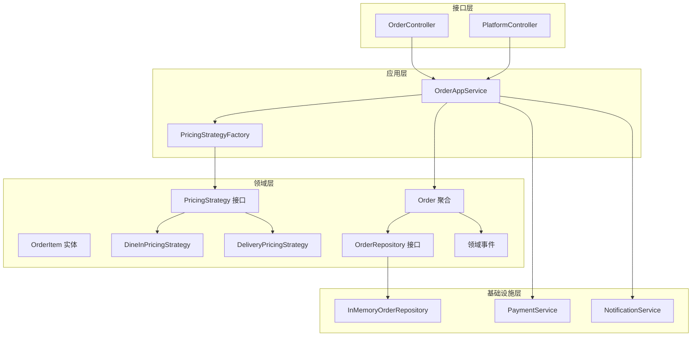

# Spring Boot 咖啡店 - 实施计划

## 项目概述
一个教育性的 Spring Boot 应用程序，通过一个支持堂食和外卖场景的咖啡店系统来演示核心编程概念。

## 核心演示概念

### 1. **领域驱动设计 (DDD)**
- 限界上下文（订单上下文）
- 聚合（订单作为聚合根）
- 值对象（Money、Address）
- 领域服务（PricingService）
- 仓储模式

### 2. **设计模式**
- **策略模式**：堂食和外卖的不同定价策略
- **工厂模式**：订单创建和定价策略选择
- **状态模式**：订单状态转换
- **建造者模式**：复杂对象构造
- **仓储模式**：数据访问抽象

### 3. **面向对象原则**
- **封装**：保护订单内部状态
- **继承**：基类和专门实现
- **多态**：具有多个实现的策略接口
- **抽象**：隐藏实现细节的接口
- **SOLID 原则**：单一职责、开闭原则、依赖倒置

### 4. **Spring Boot 特性**
- 依赖注入
- 服务层架构
- REST 控制器
- 事件处理（Spring 事件）
- 内存仓储（为了简单起见）
- 事务管理

---

## 架构概览



---

## 实施步骤

### 阶段 1：项目设置
- [ ] 创建 Spring Boot 项目结构
- [ ] 配置 Maven/Gradle 依赖（Spring Web、Spring Boot Starter）
- [ ] 按照 DDD 层次设置包结构
- [ ] 创建主应用程序类

### 阶段 2：领域层 - 核心业务逻辑
- [ ] 创建值对象：`Money`、`Address`、`OrderId`
- [ ] 创建枚举：`OrderType`、`OrderStatus`
- [ ] 创建实体：`OrderItem`
- [ ] 创建聚合根：`Order`
  - 实现带验证的构造函数
  - 实现带策略模式的 `settle()` 方法
  - 实现 `completeMaking()` 方法
  - 实现状态转换方法
- [ ] 创建领域异常：`DomainException`、`InvalidOrderStateException`
- [ ] 创建领域事件：`CoffeeReadyEvent`、`OrderCreatedEvent`

### 阶段 3：领域层 - 定价策略
- [ ] 创建 `PricingStrategy` 接口
- [ ] 实现 `DineInPricingStrategy`
- [ ] 实现 `DeliveryPricingStrategy`
- [ ] 创建 `PricingStrategyFactory`
- [ ] 添加解释策略模式用法的文档

### 阶段 4：领域层 - 仓储接口
- [ ] 创建 `OrderRepository` 接口
- [ ] 定义 CRUD 方法
- [ ] 定义查询方法（按状态、按类型、按日期范围）

### 阶段 5：基础设施层
- [ ] 实现 `InMemoryOrderRepository`
  - 使用 ConcurrentHashMap 保证线程安全
  - 实现所有仓储方法
- [ ] 创建模拟服务：`PaymentService`、`NotificationService`
- [ ] 添加日志用于演示目的

### 阶段 6：应用层
- [ ] 创建 DTO：`CreateOrderCommand`、`OrderDTO`、`OrderItemDTO`
- [ ] 创建 `OrderAssembler` 用于 DTO 转换
- [ ] 实现 `OrderAppService`
  - 带事务管理的 `placeOrder()` 方法
  - `getOrder()` 方法
  - `getAllOrders()` 方法
  - `updateOrderStatus()` 方法
- [ ] 实现领域事件的事件监听器

### 阶段 7：接口层 - REST 控制器
- [ ] 创建 `OrderController`
  - POST `/api/orders` - 创建订单
  - GET `/api/orders/{id}` - 按 ID 获取订单
  - GET `/api/orders` - 获取所有订单
  - PUT `/api/orders/{id}/status` - 更新订单状态
- [ ] 创建 `PlatformController` 用于外卖平台回调
- [ ] 添加请求验证
- [ ] 添加适当的 HTTP 状态码和错误处理

### 阶段 8：配置与测试
- [ ] 创建 Spring 配置类
- [ ] 配置依赖注入
- [ ] 添加应用程序属性
- [ ] 创建集成测试类
- [ ] 创建领域逻辑的单元测试
- [ ] 创建控制器测试

### 阶段 9：文档与示例
- [ ] 创建包含项目概览的 README
- [ ] 使用示例记录 API 端点
- [ ] 添加解释设计模式的代码注释
- [ ] 创建使用示例（curl 命令或 Postman 集合）
- [ ] 添加关键流程的序列图

### 阶段 10：演示场景
- [ ] 创建堂食订单的演示数据
- [ ] 创建外卖订单的演示数据
- [ ] 演示定价策略差异
- [ ] 演示订单状态转换
- [ ] 演示事件处理

---

## 包结构

```
com.bluemountain.coffee
├── CoffeeShopApplication.java              # 主 Spring Boot 应用程序
├── interfaces
│   ├── dto
│   │   ├── CreateOrderCommand.java
│   │   ├── OrderDTO.java
│   │   └── OrderItemDTO.java
│   ├── web
│   │   └── OrderController.java
│   └── platform
│       └── PlatformController.java
├── application
│   ├── OrderAppService.java
│   ├── OrderAssembler.java
│   └── PricingStrategyFactory.java
├── domain
│   ├── model
│   │   ├── aggregate
│   │   │   ├── Order.java
│   │   │   └── OrderItem.java
│   │   ├── valobj
│   │   │   ├── Money.java
│   │   │   ├── Address.java
│   │   │   └── OrderId.java
│   │   └── enums
│   │       ├── OrderType.java
│   │       └── OrderStatus.java
│   ├── service
│   │   └── PricingStrategy.java
│   ├── strategy
│   │   ├── DineInPricingStrategy.java
│   │   └── DeliveryPricingStrategy.java
│   ├── repository
│   │   └── OrderRepository.java
│   ├── event
│   │   ├── CoffeeReadyEvent.java
│   │   └── OrderCreatedEvent.java
│   └── exception
│       ├── DomainException.java
│       └── InvalidOrderStateException.java
└── infrastructure
    ├── persistence
    │   └── InMemoryOrderRepository.java
    └── service
        ├── PaymentService.java
        └── NotificationService.java
```

---

## 关键实现细节

### 策略模式实现
```java
public interface PricingStrategy {
    Money calculate(Order order);
}

public class DineInPricingStrategy implements PricingStrategy {
    @Override
    public Money calculate(Order order) {
        // 仅计算商品总价
    }
}

public class DeliveryPricingStrategy implements PricingStrategy {
    private static final Money PACKAGING_FEE = new Money(2.0);
    private static final Money DELIVERY_FEE = new Money(5.0);
    
    @Override
    public Money calculate(Order order) {
        // 计算商品总价 + 包装费 + 配送费
    }
}
```

### 工厂模式实现
```java
@Component
public class PricingStrategyFactory {
    private final Map<OrderType, PricingStrategy> strategies;
    
    public PricingStrategyFactory(
            DineInPricingStrategy dineInStrategy,
            DeliveryPricingStrategy deliveryStrategy) {
        this.strategies = Map.of(
            OrderType.DINE_IN, dineInStrategy,
            OrderType.DELIVERY, deliveryStrategy
        );
    }
    
    public PricingStrategy getStrategy(OrderType type) {
        return strategies.get(type);
    }
}
```

### 状态模式实现
```java
public enum OrderStatus {
    CREATED, SETTLED, PREPARING, READY, COMPLETED, CANCELLED
}

public class Order {
    public void transitionTo(OrderStatus newStatus) {
        // 验证状态转换
        // 更新状态
        // 如有需要，发布领域事件
    }
}
```

---

## 技术栈

- **Java**：17 或 21
- **Spring Boot**：3.x
- **构建工具**：Maven 或 Gradle
- **测试**：JUnit 5、Mockito
- **文档**：SpringDoc OpenAPI（可选）

---

## 成功标准

✅ 各层之间清晰的关注点分离
✅ 所有设计模式正确实现并记录
✅ 清晰演示 OOP 原则
✅ 工作的 REST API，具有适当的错误处理
✅ 解释概念的全面代码注释
✅ 核心业务逻辑的测试覆盖
✅ 易于理解和修改

---

## 实施说明

1. **保持简单**：使用内存存储以专注于概念，而非基础设施
2. **教育重点**：优先考虑代码清晰度和文档，而非性能优化
3. **真实世界的模式**：即使简化，也要使用可扩展到生产环境的模式
4. **类型安全**：利用 Java 的类型系统实现编译时安全
5. **不可变性**：在适当的地方使用不可变值对象
6. **验证**：在边界（控制器、构造函数）添加输入验证
7. **日志记录**：添加战略性日志以演示流程和调试
