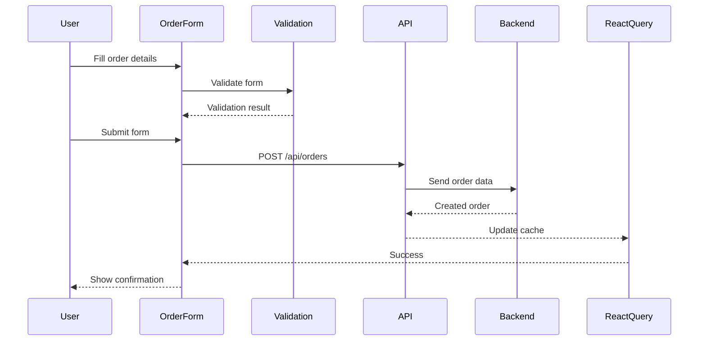
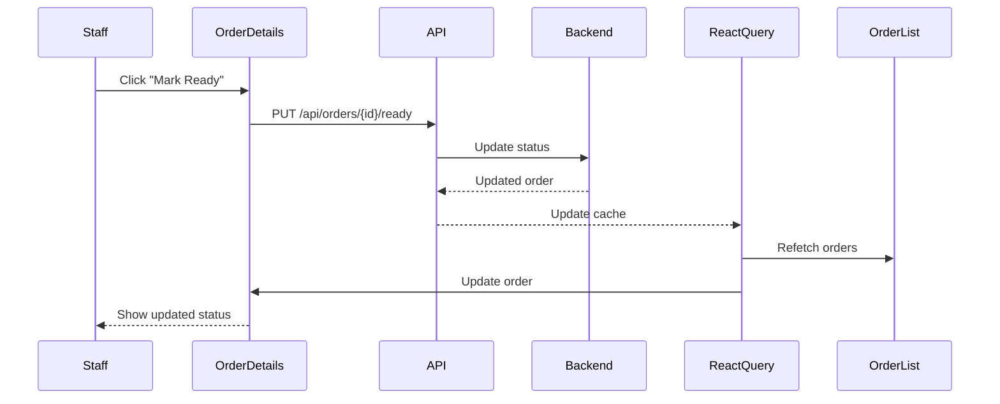
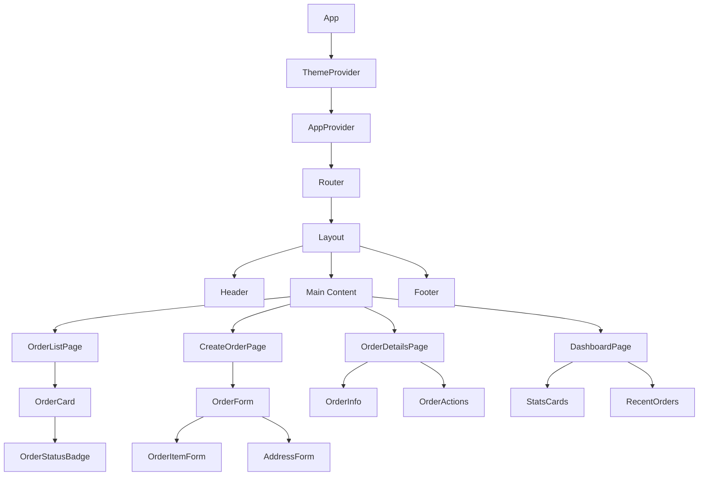

# React Frontend Architecture Plan - Blue Mountain Coffee Shop

## 📋 Executive Summary

This document outlines the comprehensive architecture and implementation plan for building a React-based frontend for the Blue Mountain Coffee Shop system. The frontend will integrate with the existing Spring Boot backend API to provide a complete coffee ordering and management experience.

---

## 🎯 Project Overview

### Backend API Summary
- **Base URL**: `http://localhost:8080`
- **API Version**: RESTful JSON API
- **Authentication**: None (demo/educational project)
- **Core Entities**: Orders, Order Items, Customers

### Key Features to Implement
1. **Customer-facing Order Creation**
   - Dine-in order placement
   - Delivery order placement with address
   - Real-time order status tracking

2. **Order Management Dashboard**
   - View all orders
   - Filter by status
   - Update order status
   - Complete/cancel orders

3. **Order Details View**
   - Detailed order information
   - Order items breakdown
   - Pricing breakdown (item totals, fees, grand total)

---

## 🏗️ Technology Stack

### Core Framework
- **React 18.x** - UI library with hooks and concurrent features
- **TypeScript 5.x** - Type safety and better developer experience
- **Vite 5.x** - Fast build tool and dev server

### UI Components & Styling
- **Material-UI (MUI) 5.x** - Comprehensive React component library
  - Pre-built components (buttons, forms, cards, tables, etc.)
  - Theming system for consistent design
  - Responsive grid system
- **Emotion** - CSS-in-JS solution (included with MUI)
- **@mui/icons-material** - Icon library

### State Management
- **React Context API** - For global state (theme, user preferences)
- **React Query (TanStack Query)** - For server state management
  - Caching API responses
  - Automatic refetching
  - Optimistic updates
  - Loading/error states

### Routing
- **React Router v6** - Client-side routing
  - Nested routes
  - Route parameters
  - Programmatic navigation

### Form Handling
- **React Hook Form** - Performant form handling
- **Zod** - Schema validation
- **@hookform/resolvers** - Integration between React Hook Form and Zod

### HTTP Client
- **Axios** - HTTP client with interceptors
  - Request/response interceptors
  - Error handling
  - Request cancellation

### Development Tools
- **ESLint** - Code linting
- **Prettier** - Code formatting
- **Vitest** - Unit testing
- **React Testing Library** - Component testing
- **Playwright** - End-to-end testing (optional)

---

## 📁 Project Structure

```
frontend/
├── public/
│   ├── index.html
│   └── favicon.ico
├── src/
│   ├── assets/
│   │   ├── images/
│   │   └── icons/
│   ├── components/
│   │   ├── common/
│   │   │   ├── Button.tsx
│   │   │   ├── Card.tsx
│   │   │   ├── Loading.tsx
│   │   │   └── ErrorBoundary.tsx
│   │   ├── layout/
│   │   │   ├── Header.tsx
│   │   │   ├── Footer.tsx
│   │   │   ├── Sidebar.tsx
│   │   │   └── Layout.tsx
│   │   ├── order/
│   │   │   ├── OrderCard.tsx
│   │   │   ├── OrderItem.tsx
│   │   │   ├── OrderStatusBadge.tsx
│   │   │   └── OrderDetails.tsx
│   │   └── form/
│   │       ├── OrderForm.tsx
│   │       ├── OrderItemForm.tsx
│   │       └── AddressForm.tsx
│   ├── pages/
│   │   ├── HomePage.tsx
│   │   ├── CreateOrderPage.tsx
│   │   ├── OrderListPage.tsx
│   │   ├── OrderDetailsPage.tsx
│   │   └── DashboardPage.tsx
│   ├── hooks/
│   │   ├── useOrders.ts
│   │   ├── useOrder.ts
│   │   ├── useCreateOrder.ts
│   │   └── useOrderActions.ts
│   ├── services/
│   │   ├── api/
│   │   │   ├── client.ts
│   │   │   ├── orders.ts
│   │   │   └── types.ts
│   │   └── queries/
│   │       ├── orderQueries.ts
│   │       └── mutationQueries.ts
│   ├── contexts/
│   │   ├── ThemeContext.tsx
│   │   └── AppContext.tsx
│   ├── types/
│   │   ├── order.ts
│   │   ├── api.ts
│   │   └── index.ts
│   ├── utils/
│   │   ├── formatters.ts
│   │   ├── validators.ts
│   │   └── constants.ts
│   ├── styles/
│   │   ├── theme.ts
│   │   └── global.css
│   ├── App.tsx
│   ├── main.tsx
│   └── vite-env.d.ts
├── tests/
│   ├── unit/
│   ├── integration/
│   └── e2e/
├── .eslintrc.cjs
├── .prettierrc
├── package.json
├── tsconfig.json
├── tsconfig.node.json
├── vite.config.ts
└── vitest.config.ts
```

---

## 🎨 Component Architecture

### Component Hierarchy

```
App
├── ThemeProvider
│   └── AppProvider
│       └── Router
│           ├── Layout
│           │   ├── Header
│           │   ├── Main Content
│           │   └── Footer
│           └── Routes
│               ├── HomePage
│               │   ├── HeroSection
│               │   ├── FeaturesSection
│               │   └── CTASection
│               ├── CreateOrderPage
│               │   ├── OrderForm
│               │   │   ├── CustomerInfoForm
│               │   │   ├── OrderTypeSelector
│               │   │   ├── OrderItemsForm
│               │   │   └── AddressForm (conditional)
│               │   └── OrderSummary
│               ├── OrderListPage
│               │   ├── OrderFilters
│               │   └── OrderGrid
│               │       └── OrderCard (multiple)
│               ├── OrderDetailsPage
│               │   ├── OrderInfo
│               │   ├── OrderItemsList
│               │   ├── OrderActions
│               │   └── OrderTimeline
│               └── DashboardPage
│                   ├── StatsCards
│                   ├── RecentOrders
│                   └── StatusChart
```

### Component Responsibilities

#### Layout Components
- **Layout**: Main layout wrapper with responsive design
- **Header**: Navigation, branding, user actions
- **Footer**: Copyright, links, contact info
- **Sidebar**: Navigation menu (for admin/dashboard views)

#### Page Components
- **HomePage**: Landing page with coffee shop information
- **CreateOrderPage**: Order creation form with multi-step wizard
- **OrderListPage**: List of all orders with filtering
- **OrderDetailsPage**: Detailed view of a single order
- **DashboardPage**: Admin dashboard with statistics

#### Feature Components
- **OrderForm**: Main order creation form
- **OrderCard**: Display order summary in list view
- **OrderItem**: Display individual order item
- **OrderStatusBadge**: Visual status indicator
- **OrderDetails**: Detailed order information
- **AddressForm**: Delivery address input form

#### Common Components
- **Button**: Reusable button with variants
- **Card**: Container component with elevation
- **Loading**: Loading spinner/skeleton
- **ErrorBoundary**: Error handling wrapper

---

## 🔄 State Management Strategy

### Global State (React Context)
```typescript
// ThemeContext
interface ThemeContextType {
  theme: 'light' | 'dark';
  toggleTheme: () => void;
}

// AppContext
interface AppContextType {
  notifications: Notification[];
  addNotification: (notification: Notification) => void;
  removeNotification: (id: string) => void;
}
```

### Server State (React Query)
```typescript
// Queries
- useOrders() - Fetch all orders
- useOrder(id) - Fetch single order
- useOrdersByStatus(status) - Fetch orders by status

// Mutations
- useCreateOrder() - Create new order
- useUpdateOrderStatus() - Update order status
- useMarkReady() - Mark order as ready
- useCompleteOrder() - Complete order
- useCancelOrder() - Cancel order
```

### Local State (useState/useReducer)
- Form inputs
- UI toggles (modals, dropdowns)
- Temporary selections

---

## 🛣️ Routing Structure

```typescript
const routes = [
  {
    path: '/',
    element: <HomePage />,
  },
  {
    path: '/orders',
    element: <OrderListPage />,
  },
  {
    path: '/orders/create',
    element: <CreateOrderPage />,
  },
  {
    path: '/orders/:id',
    element: <OrderDetailsPage />,
  },
  {
    path: '/dashboard',
    element: <DashboardPage />,
  },
  {
    path: '*',
    element: <NotFoundPage />,
  },
];
```

### Route Parameters
- `:id` - Order ID for order details page

### Protected Routes (Future Enhancement)
- Dashboard routes could be protected with authentication

---

## 🔌 API Integration Layer

### API Client Configuration

```typescript
// src/services/api/client.ts
import axios from 'axios';

const apiClient = axios.create({
  baseURL: 'http://localhost:8080/api',
  timeout: 10000,
  headers: {
    'Content-Type': 'application/json',
  },
});

// Request interceptor
apiClient.interceptors.request.use(
  (config) => {
    // Add auth token if available
    return config;
  },
  (error) => Promise.reject(error)
);

// Response interceptor
apiClient.interceptors.response.use(
  (response) => response,
  (error) => {
    // Handle common errors
    return Promise.reject(error);
  }
);

export default apiClient;
```

### API Service Functions

```typescript
// src/services/api/orders.ts
import apiClient from './client';
import type { Order, CreateOrderCommand, OrderStatus } from './types';

export const ordersApi = {
  // Get all orders
  getAll: () => apiClient.get<Order[]>('/orders'),

  // Get order by ID
  getById: (id: string) => apiClient.get<Order>(`/orders/${id}`),

  // Get orders by status
  getByStatus: (status: string) =>
    apiClient.get<Order[]>(`/orders/status/${status}`),

  // Create order
  create: (data: CreateOrderCommand) =>
    apiClient.post<Order>('/orders', data),

  // Update order status
  updateStatus: (id: string, status: string) =>
    apiClient.put<Order>(`/orders/${id}/status`, null, {
      params: { status },
    }),

  // Mark as ready
  markReady: (id: string) =>
    apiClient.put<Order>(`/orders/${id}/ready`),

  // Complete order
  complete: (id: string) =>
    apiClient.put<Order>(`/orders/${id}/complete`),

  // Cancel order
  cancel: (id: string) =>
    apiClient.delete<Order>(`/orders/${id}`),
};
```

### TypeScript Types

```typescript
// src/services/api/types.ts
export interface Order {
  id: string;
  customerName: string;
  orderType: 'DINE_IN' | 'DELIVERY';
  status: OrderStatus;
  items: OrderItem[];
  totalPrice: number;
  createdAt: string;
  updatedAt: string;
  address?: Address;
}

export interface OrderItem {
  productName: string;
  quantity: number;
  unitPrice: number;
  totalPrice: number;
}

export interface Address {
  street: string;
  city: string;
  postalCode: string;
  country: string;
}

export interface CreateOrderCommand {
  customerName: string;
  orderType: 'DINE_IN' | 'DELIVERY';
  items: OrderItem[];
  street?: string;
  city?: string;
  postalCode?: string;
  country?: string;
}

export type OrderStatus =
  | 'CREATED'
  | 'PAID'
  | 'PREPARING'
  | 'READY'
  | 'COMPLETED'
  | 'CANCELLED';
```

---

## 🎯 React Query Hooks

```typescript
// src/hooks/useOrders.ts
import { useQuery } from '@tanstack/react-query';
import { ordersApi } from '../services/api/orders';

export function useOrders() {
  return useQuery({
    queryKey: ['orders'],
    queryFn: ordersApi.getAll,
    staleTime: 30000, // 30 seconds
  });
}

export function useOrder(id: string) {
  return useQuery({
    queryKey: ['orders', id],
    queryFn: () => ordersApi.getById(id),
    enabled: !!id,
  });
}

export function useOrdersByStatus(status: string) {
  return useQuery({
    queryKey: ['orders', 'status', status],
    queryFn: () => ordersApi.getByStatus(status),
    enabled: !!status,
  });
}

export function useCreateOrder() {
  const queryClient = useQueryClient();

  return useMutation({
    mutationFn: ordersApi.create,
    onSuccess: () => {
      queryClient.invalidateQueries({ queryKey: ['orders'] });
    },
  });
}

export function useUpdateOrderStatus() {
  const queryClient = useQueryClient();

  return useMutation({
    mutationFn: ({ id, status }: { id: string; status: string }) =>
      ordersApi.updateStatus(id, status),
    onSuccess: () => {
      queryClient.invalidateQueries({ queryKey: ['orders'] });
    },
  });
}

export function useMarkReady() {
  const queryClient = useQueryClient();

  return useMutation({
    mutationFn: ordersApi.markReady,
    onSuccess: () => {
      queryClient.invalidateQueries({ queryKey: ['orders'] });
    },
  });
}

export function useCompleteOrder() {
  const queryClient = useQueryClient();

  return useMutation({
    mutationFn: ordersApi.complete,
    onSuccess: () => {
      queryClient.invalidateQueries({ queryKey: ['orders'] });
    },
  });
}

export function useCancelOrder() {
  const queryClient = useQueryClient();

  return useMutation({
    mutationFn: ordersApi.cancel,
    onSuccess: () => {
      queryClient.invalidateQueries({ queryKey: ['orders'] });
    },
  });
}
```

---

## 📝 Form Handling with React Hook Form

### Order Form Schema (Zod)

```typescript
// src/utils/validators.ts
import { z } from 'zod';

export const orderItemSchema = z.object({
  productName: z.string().min(1, 'Product name is required'),
  quantity: z.number().min(1, 'Quantity must be at least 1'),
  unitPrice: z.number().min(0, 'Price must be positive'),
});

export const addressSchema = z.object({
  street: z.string().min(1, 'Street is required'),
  city: z.string().min(1, 'City is required'),
  postalCode: z.string().min(1, 'Postal code is required'),
  country: z.string().min(1, 'Country is required'),
});

export const orderFormSchema = z
  .object({
    customerName: z.string().min(1, 'Customer name is required'),
    orderType: z.enum(['DINE_IN', 'DELIVERY']),
    items: z
      .array(orderItemSchema)
      .min(1, 'At least one item is required'),
    street: z.string().optional(),
    city: z.string().optional(),
    postalCode: z.string().optional(),
    country: z.string().optional(),
  })
  .refine(
    (data) => {
      if (data.orderType === 'DELIVERY') {
        return (
          data.street &&
          data.city &&
          data.postalCode &&
          data.country
        );
      }
      return true;
    },
    {
      message: 'Address is required for delivery orders',
      path: ['address'],
    }
  );

export type OrderFormData = z.infer<typeof orderFormSchema>;
```

### Order Form Component

```typescript
// src/components/form/OrderForm.tsx
import { useForm } from 'react-hook-form';
import { zodResolver } from '@hookform/resolvers/zod';
import { orderFormSchema, type OrderFormData } from '../../utils/validators';
import { useCreateOrder } from '../../hooks/useOrders';

export function OrderForm() {
  const {
    register,
    handleSubmit,
    watch,
    formState: { errors },
  } = useForm<OrderFormData>({
    resolver: zodResolver(orderFormSchema),
    defaultValues: {
      orderType: 'DINE_IN',
      items: [{ productName: '', quantity: 1, unitPrice: 0 }],
    },
  });

  const orderType = watch('orderType');
  const createOrder = useCreateOrder();

  const onSubmit = (data: OrderFormData) => {
    createOrder.mutate(data);
  };

  return (
    <form onSubmit={handleSubmit(onSubmit)}>
      {/* Customer Name */}
      <TextField
        {...register('customerName')}
        label="Customer Name"
        error={!!errors.customerName}
        helperText={errors.customerName?.message}
      />

      {/* Order Type */}
      <RadioGroup {...register('orderType')}>
        <FormControlLabel value="DINE_IN" control={<Radio />} label="Dine In" />
        <FormControlLabel value="DELIVERY" control={<Radio />} label="Delivery" />
      </RadioGroup>

      {/* Order Items */}
      {/* Dynamic form fields for items */}

      {/* Address Form (conditional) */}
      {orderType === 'DELIVERY' && (
        <AddressForm register={register} errors={errors} />
      )}

      <Button type="submit" disabled={createOrder.isPending}>
        {createOrder.isPending ? 'Creating...' : 'Create Order'}
      </Button>
    </form>
  );
}
```

---

## 🎨 UI Design System

### Theme Configuration

```typescript
// src/styles/theme.ts
import { createTheme } from '@mui/material/styles';

const theme = createTheme({
  palette: {
    primary: {
      main: '#6F4E37', // Coffee brown
      light: '#9E7E68',
      dark: '#4A3526',
    },
    secondary: {
      main: '#C4A77D', // Latte color
      light: '#D6C4A8',
      dark: '#8B7355',
    },
    background: {
      default: '#FAFAFA',
      paper: '#FFFFFF',
    },
  },
  typography: {
    fontFamily: '"Inter", "Roboto", "Helvetica", "Arial", sans-serif',
    h1: {
      fontSize: '2.5rem',
      fontWeight: 700,
    },
    h2: {
      fontSize: '2rem',
      fontWeight: 600,
    },
    h3: {
      fontSize: '1.75rem',
      fontWeight: 600,
    },
  },
  components: {
    MuiButton: {
      styleOverrides: {
        root: {
          borderRadius: 8,
          textTransform: 'none',
          fontWeight: 600,
        },
      },
    },
    MuiCard: {
      styleOverrides: {
        root: {
          borderRadius: 12,
          boxShadow: '0 2px 8px rgba(0,0,0,0.1)',
        },
      },
    },
  },
});

export default theme;
```

### Color Scheme
- **Primary**: Coffee Brown (#6F4E37)
- **Secondary**: Latte (#C4A77D)
- **Success**: Green (#4CAF50)
- **Warning**: Orange (#FF9800)
- **Error**: Red (#F44336)
- **Info**: Blue (#2196F3)

### Status Colors
- **CREATED**: Gray (#9E9E9E)
- **PAID**: Blue (#2196F3)
- **PREPARING**: Orange (#FF9800)
- **READY**: Green (#4CAF50)
- **COMPLETED**: Teal (#009688)
- **CANCELLED**: Red (#F44336)

---

## 📱 Responsive Design

### Breakpoints
- **xs**: 0px (mobile)
- **sm**: 600px (small tablet)
- **md**: 900px (tablet)
- **lg**: 1200px (desktop)
- **xl**: 1536px (large desktop)

### Layout Strategies
- **Mobile**: Single column, stacked layout
- **Tablet**: Two-column grid for order cards
- **Desktop**: Three-column grid, sidebar navigation

---

## 🧪 Testing Strategy

### Unit Tests (Vitest)
- Component rendering
- Custom hooks
- Utility functions
- Form validation

### Integration Tests (React Testing Library)
- User interactions
- Form submissions
- Navigation
- API integration

### E2E Tests (Playwright - Optional)
- Complete user flows
- Order creation process
- Order management workflows

---

## 🚀 Implementation Phases

### Phase 1: Project Setup & Infrastructure
- Initialize React + TypeScript + Vite project
- Configure Material-UI and theme
- Set up routing structure
- Configure ESLint and Prettier
- Set up API client with Axios

### Phase 2: Core Components & Layout
- Create layout components (Header, Footer, Layout)
- Implement routing with React Router
- Create common components (Button, Card, Loading)
- Set up theme provider and context

### Phase 3: API Integration
- Create TypeScript types for API responses
- Implement API service functions
- Set up React Query provider
- Create custom hooks for data fetching
- Implement error handling

### Phase 4: Order Management Features
- Build order list page with filtering
- Create order details page
- Implement order status updates
- Add order completion/cancellation
- Create order cards and status badges

### Phase 5: Order Creation Flow
- Build order creation form
- Implement multi-step wizard
- Add dynamic order item fields
- Implement conditional address form
- Add form validation
- Connect to API

### Phase 6: Dashboard & Analytics
- Create dashboard page
- Implement statistics cards
- Add recent orders section
- Create status distribution chart

### Phase 7: Polish & Optimization
- Add loading states and skeletons
- Implement error boundaries
- Add notifications/toasts
- Optimize performance
- Improve accessibility
- Add animations and transitions

### Phase 8: Testing & Documentation
- Write unit tests
- Write integration tests
- Create component documentation
- Write user guide
- Prepare deployment

---

## 📦 Dependencies

### Production Dependencies
```json
{
  "react": "^18.2.0",
  "react-dom": "^18.2.0",
  "react-router-dom": "^6.20.0",
  "@mui/material": "^5.14.0",
  "@mui/icons-material": "^5.14.0",
  "@emotion/react": "^11.11.0",
  "@emotion/styled": "^11.11.0",
  "@tanstack/react-query": "^5.0.0",
  "axios": "^1.6.0",
  "react-hook-form": "^7.48.0",
  "zod": "^3.22.0",
  "@hookform/resolvers": "^3.3.0",
  "date-fns": "^2.30.0"
}
```

### Development Dependencies
```json
{
  "@types/react": "^18.2.0",
  "@types/react-dom": "^18.2.0",
  "@typescript-eslint/eslint-plugin": "^6.0.0",
  "@typescript-eslint/parser": "^6.0.0",
  "@vitejs/plugin-react": "^4.2.0",
  "vite": "^5.0.0",
  "eslint": "^8.55.0",
  "eslint-plugin-react-hooks": "^4.6.0",
  "eslint-plugin-react-refresh": "^0.4.0",
  "prettier": "^3.1.0",
  "vitest": "^1.0.0",
  "@testing-library/react": "^14.1.0",
  "@testing-library/jest-dom": "^6.1.0",
  "@testing-library/user-event": "^14.5.0"
}
```

---

## 🔧 Configuration Files

### vite.config.ts
```typescript
import { defineConfig } from 'vite';
import react from '@vitejs/plugin-react';
import path from 'path';

export default defineConfig({
  plugins: [react()],
  resolve: {
    alias: {
      '@': path.resolve(__dirname, './src'),
    },
  },
  server: {
    port: 3000,
    proxy: {
      '/api': {
        target: 'http://localhost:8080',
        changeOrigin: true,
      },
    },
  },
});
```

### tsconfig.json
```json
{
  "compilerOptions": {
    "target": "ES2020",
    "useDefineForClassFields": true,
    "lib": ["ES2020", "DOM", "DOM.Iterable"],
    "module": "ESNext",
    "skipLibCheck": true,
    "moduleResolution": "bundler",
    "allowImportingTsExtensions": true,
    "resolveJsonModule": true,
    "isolatedModules": true,
    "noEmit": true,
    "jsx": "react-jsx",
    "strict": true,
    "noUnusedLocals": true,
    "noUnusedParameters": true,
    "noFallthroughCasesInSwitch": true,
    "baseUrl": ".",
    "paths": {
      "@/*": ["./src/*"]
    }
  },
  "include": ["src"],
  "references": [{ "path": "./tsconfig.node.json" }]
}
```

---

## 🎯 Key Features Summary

### Customer Features
1. **Browse Menu** (Future Enhancement)
   - View available coffee products
   - See prices and descriptions
   - Add items to cart

2. **Create Order**
   - Choose dine-in or delivery
   - Add multiple items
   - Enter delivery address (if applicable)
   - See real-time price calculation

3. **Track Order**
   - View order status
   - See estimated completion time
   - Receive notifications

### Admin/Staff Features
1. **Order Dashboard**
   - View all orders
   - Filter by status
   - Sort by date/time

2. **Order Management**
   - Update order status
   - Mark as ready
   - Complete orders
   - Cancel orders

3. **Analytics** (Future Enhancement)
   - Sales statistics
   - Popular items
   - Peak hours

---

## 🔄 Data Flow Diagrams

### Order Creation Flow



### Order Status Update Flow



---

## 📊 Component Interaction Diagram



---

## 🎓 Learning Outcomes

This React frontend implementation will demonstrate:

1. **Modern React Patterns**
   - Hooks and custom hooks
   - Context API for state management
   - Composition patterns
   - Render props and HOCs (if needed)

2. **TypeScript Best Practices**
   - Type safety throughout the application
   - Generic types for reusable components
   - Type inference and type guards
   - Strict type checking

3. **State Management**
   - Server state with React Query
   - Global state with Context API
   - Local state with useState/useReducer
   - Form state with React Hook Form

4. **API Integration**
   - RESTful API consumption
   - Error handling and retry logic
   - Caching and optimization
   - Request/response interceptors

5. **UI/UX Design**
   - Component-based architecture
   - Responsive design
   - Accessibility (WCAG compliance)
   - User feedback and loading states

6. **Testing**
   - Unit testing with Vitest
   - Integration testing with React Testing Library
   - Component testing
   - E2E testing (optional)

7. **Performance Optimization**
   - Code splitting and lazy loading
   - Memoization with useMemo/useCallback
   - Virtual scrolling for large lists
   - Image optimization

---

## 📝 Next Steps

1. **Review and Approve Plan**
   - Stakeholder review
   - Feedback incorporation
   - Final approval

2. **Environment Setup**
   - Install dependencies
   - Configure development environment
   - Set up version control

3. **Begin Implementation**
   - Start with Phase 1 (Project Setup)
   - Follow phased approach
   - Regular code reviews

4. **Testing & Deployment**
   - Comprehensive testing
   - Bug fixes and refinements
   - Production deployment

---

## 📞 Support & Resources

### Documentation
- [React Documentation](https://react.dev/)
- [Material-UI Documentation](https://mui.com/)
- [React Query Documentation](https://tanstack.com/query/latest)
- [React Hook Form Documentation](https://react-hook-form.com/)
- [TypeScript Documentation](https://www.typescriptlang.org/)

### Backend API Reference
- Base URL: `http://localhost:8080/api`
- API Documentation: See README.md in backend project

---

**Document Version**: 1.0
**Last Updated**: 2026-01-18
**Author**: Architect Mode
