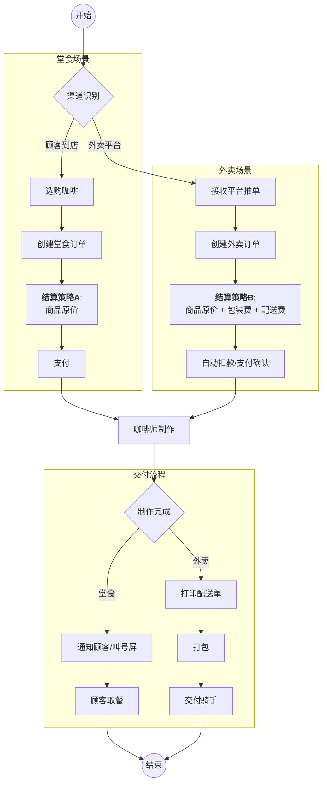

作为业务架构师，我将为您梳理“蓝山咖啡店”业务系统的设计。我们将从业务流程出发，利用领域驱动设计（DDD）界定边界，通过设计模式处理差异，最后落实到面向对象（OOP）的代码实现。

---

### 1. 业务描述与统一语言 (Ubiquitous Language)

在构建系统前，我们需要统一业务术语，确保技术与业务理解一致：

* **订单 (Order)**: 交易的核心聚合根。
* **订单项 (OrderItem)**: 具体的咖啡产品及规格（如：蓝山咖啡，大杯，热）。
* **结算 (Settlement/Checkout)**: 计算最终金额的过程。
* **制作 (Barista Make)**: 吧台的生产活动。
* **配送/交付 (Fulfillment)**: 包含堂食的“取餐”和外卖的“骑手交接”。
* **场景策略**: 区分“堂食 (Dine-in)”与“外卖 (Delivery)”，主要差异在于**定价逻辑**（包装费、配送费）和**交付方式**。

---

### 2. 分场景业务流程图

我们使用 Mermaid 绘制流程。可以看到核心流程相似，但在“结算”和“交付”环节存在分岔。



---

### 3. 业务架构、DDD、设计模式与 OOP 的关系映射

作为架构师，我们需要理解这四个层级是如何层层递进落地的：

| 层面 | 核心思想 | 在本项目中的体现 |
| --- | --- | --- |
| **业务架构** | **价值流与能力** | 识别出“订单履约能力”、“全渠道接入能力”。业务要求同一套内核支持不同渠道，且计费规则不同。 |
| **DDD** | **限界上下文与聚合** | **核心域**：订单上下文。**聚合根**：Order。**值对象**：Money, Address。**领域服务**：价格计算服务（处理复杂的计费逻辑）。 |
| **设计模式** | **复用与解耦** | **策略模式 (Strategy)**：处理堂食与外卖不同的“计费算法”。<br>

<br>**工厂模式 (Factory)**：构建复杂的订单对象。<br>

<br>**状态模式 (State)**：管理订单从“已创建”到“已完成”的状态流转。 |
| **OOP** | **封装、继承、多态** | 通过接口 (`PricingStrategy`) 定义契约，利用多态实现不同计费逻辑；通过封装保护 `Order` 内部状态不被随意修改。 |

---

### 4. Java 项目结构 (DDD 分层架构)

为了保持业务逻辑的纯净，我们采用经典的 4 层架构：

```text
com.bluemountain.coffee
├── interfaces          // 接入层：Controller, DTO, Facade
│   ├── web             // 处理堂食点单请求
│   └── platform        // 处理美团/饿了么回调
├── application         // 应用层：编排业务流程，不包含核心业务规则
│   └── OrderAppService.java
├── domain              // 领域层：核心业务逻辑 (POJO, 无框架依赖)
│   ├── model
│   │   ├── aggregate   // Order, OrderItem
│   │   ├── valobj      // Money, DeliveryInfo
│   │   └── entity
│   ├── service         // Domain Service
│   │   └── PricingService.java
│   └── repository      // 仓储接口
├── infrastructure      // 基础设施层：数据库, 第三方API
│   └── persistence

```

---

### 5. 核心代码实现 (Java 伪代码)

核心设计点：使用 **策略模式** 解决结算差异，使用 **充血模型** 保护业务规则。

#### A. 领域层 (Domain Layer) - 核心逻辑

**1. 策略接口与实现 (处理结算差异)**

```java
// 价格计算策略接口
public interface PricingStrategy {
    Money calculate(Order order);
}

// 场景1：堂食计费策略
public class DineInPricingStrategy implements PricingStrategy {
    @Override
    public Money calculate(Order order) {
        // 仅计算咖啡本身价格
        return order.getItems().stream()
                .map(OrderItem::getSubTotal)
                .reduce(Money.ZERO, Money::add);
    }
}

// 场景2：外卖计费策略
public class DeliveryPricingStrategy implements PricingStrategy {
    private final Money PACKAGING_FEE = new Money(2.0); // 包装费
    private final Money DELIVERY_FEE = new Money(5.0);  // 配送费

    @Override
    public Money calculate(Order order) {
        Money itemTotal = order.getItems().stream()
                .map(OrderItem::getSubTotal)
                .reduce(Money.ZERO, Money::add);
        // 增加包装费与配送费
        return itemTotal.add(PACKAGING_FEE).add(DELIVERY_FEE);
    }
}

```

**2. 聚合根 (Order) - 充血模型**

```java
public class Order {
    private OrderId id;
    private List<OrderItem> items;
    private OrderStatus status;
    private OrderType type; // DINE_IN or DELIVERY
    private Money totalAmount;
    private DeliveryInfo deliveryInfo; // 仅外卖有值

    // 构造逻辑，通常配合 Factory 使用
    public Order(List<OrderItem> items, OrderType type) {
        this.items = items;
        this.type = type;
        this.status = OrderStatus.CREATED;
    }

    // 核心业务行为：结算
    // 将策略注入，Order 负责调用，但不关心具体算法（DIP原则）
    public void settle(PricingStrategy pricingStrategy) {
        if (this.status != OrderStatus.CREATED) {
            throw new DomainException("仅新订单可结算");
        }
        this.totalAmount = pricingStrategy.calculate(this);
        this.status = OrderStatus.SETTLED;
    }

    // 核心业务行为：制作完成
    public void completeMaking() {
        this.status = OrderStatus.READY;
        // 触发领域事件：通知取餐或打印配送单
        DomainEventPublisher.publish(new CoffeeReadyEvent(this));
    }
    
    // 省略 Getter
}

```

#### B. 应用层 (Application Layer) - 流程编排

这里体现了**业务架构**的落地，应用层根据输入（堂食还是外卖），组装不同的策略。

```java
@Service
public class OrderAppService {
    
    private final OrderRepository orderRepository;
    private final PaymentService paymentService;

    // 策略工厂（根据类型返回对应的 PricingStrategy）
    private final PricingStrategyFactory pricingStrategyFactory;

    // 场景1 & 2 通用的下单接口
    @Transactional
    public OrderDTO placeOrder(CreateOrderCommand cmd) {
        // 1. 转换 DTO 到领域对象
        Order order = OrderFactory.create(cmd);
        
        // 2. 获取对应的计费策略 (关键点：多态的体现)
        // 如果是堂食，返回 DineInPricingStrategy
        // 如果是外卖，返回 DeliveryPricingStrategy
        PricingStrategy strategy = pricingStrategyFactory.getStrategy(order.getType());
        
        // 3. 领域行为：结算
        order.settle(strategy);
        
        // 4. 持久化
        orderRepository.save(order);
        
        // 5. 调用支付服务 (Infra层)
        paymentService.process(order);
        
        return OrderAssembler.toDTO(order);
    }
    
    // 监听制作完成事件（处理交付差异）
    @EventListener
    public void handleCoffeeReady(CoffeeReadyEvent event) {
        Order order = event.getOrder();
        if (order.getType() == OrderType.DINE_IN) {
            // 场景1：通知堂食顾客
            NotificationService.notifyCustomer(order.getId());
        } else {
            // 场景2：外卖逻辑
            TicketPrinter.printDeliverySlip(order); // 打印配送单
            ThirdPartyDeliveryService.callRider(order); // 呼叫骑手
        }
    }
}

```

---

### 6. 总结

1. **接口 (Interface)**: 控制器层接收到了“堂食”或“外卖”的请求。
2. **组件 (Component/Factory)**: `PricingStrategyFactory` 充当了组件的角色，根据上下文选择正确的业务规则。
3. **服务 (Service)**: `OrderAppService` 编排了整个流程，它不包含计算逻辑，只负责指挥。
4. **领域 (Domain)**: `Order` 和 `PricingStrategy` 承载了核心逻辑。通过 **策略模式**，我们将“变”（价格计算）与“不变”（订单状态流转）分离，完美契合了**开闭原则 (OCP)**。

这种架构使得如果未来蓝山咖啡店增加了“企业团购”场景（新的价格策略），我们只需新增一个 `GroupBuyPricingStrategy` 类，而无需修改核心的 `Order` 逻辑。